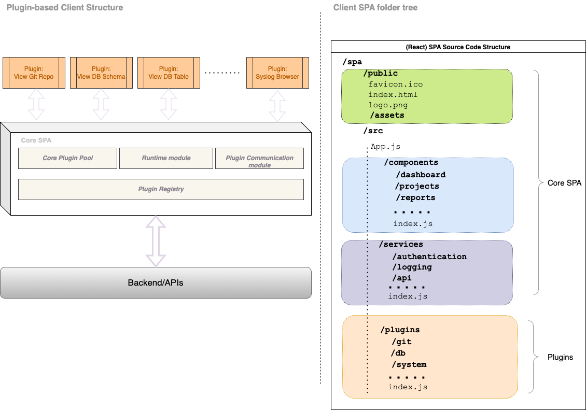

### Plugin-based SPA Architecture
Technically, there are two widely used client-side architectures for complex
applications:
* Microfrontend
* Plugin-based

The example given at the diagram below prefers dynamically loaded plugins
a.k.a. components in the front-end world.

#### Very General View

#### Tech Stack, Toolkit, Whatever...

Despite the fact *Angular*, *React* or *Vue* are equally capable 
competitors in this game, React of these three offers the most flexible 
and less prone to unexpected side-effects approach:

* [React Pluggable](https://react-pluggable.github.io/) is a kind of infrastructure out-of-the-box (a good candidate).
* Any plugin in such an environment may be implemented, tested and integrated
independently of anything else.
* Any plugin may be called and used at runtime.
